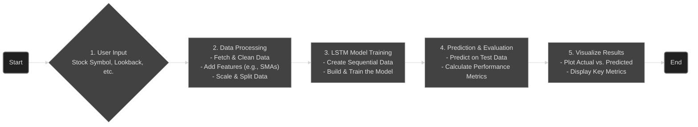

```mermaid
%%{init: {'theme': 'dark'}}%%
graph LR
    A(Start) --> B{"1. User Input<br/>Stock Symbol, Lookback, etc."};
    B --> C["2. Data Processing<br/>- Fetch & Clean Data<br/>- Add Features (e.g., SMAs)<br/>- Scale & Split Data"];
    C --> D["3. LSTM Model Training<br/>- Create Sequential Data<br/>- Build & Train the Model"];
    D --> E["4. Prediction & Evaluation<br/>- Predict on Test Data<br/>- Calculate Performance Metrics"];
    E --> F["5. Visualize Results<br/>- Plot Actual vs. Predicted<br/>- Display Key Metrics"];
    F --> G(End);

    style A fill:#212121,stroke:#757575,stroke-width:2px,color:#e0e0e0
    style G fill:#212121,stroke:#757575,stroke-width:2px,color:#e0e0e0
    style B fill:#424242,stroke:#9e9e9e,stroke-width:1px,color:#e0e0e0
    style C fill:#424242,stroke:#9e9e9e,stroke-width:1px,color:#e0e0e0
    style D fill:#424242,stroke:#9e9e9e,stroke-width:1px,color:#e0e0e0
    style E fill:#424242,stroke:#9e9e9e,stroke-width:1px,color:#e0e0e0
    style F fill:#424242,stroke:#9e9e9e,stroke-width:1px,color:#e0e0e0
```