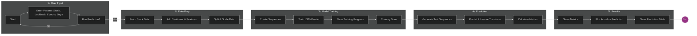

```mermaid 
---
config:
  theme: dark
  layout: dagre
---
flowchart LR
 subgraph subGraph0["1\. User Input"]
        A["Start"]
        B["Enter Params: Stock, Lookback, Epochs, Days"]
        C["Run Prediction?"]
  end
 subgraph subGraph1["2\. Data Prep"]
        D["Fetch Stock Data"]
        E["Add Sentiment & Features"]
        F["Split & Scale Data"]
  end
 subgraph subGraph2["3\. Model Training"]
        G["Create Sequences"]
        H["Train LSTM Model"]
        I["Show Training Progress"]
        J["Training Done"]
  end
 subgraph subGraph3["4\. Prediction"]
        M["Calculate Metrics"]
        L["Predict & Inverse Transform"]
        K["Generate Test Sequences"]
        
  end
 subgraph subGraph4["5\. Results"]
        N["Show Metrics"]
        O["Plot Actual vs Predicted"]
        P["Show Prediction Table"]
  end
    A --> B
    B --> C
    C -- Yes --> D
    D --> E
    E --> F
    F --> G
    G --> H
    H --> I
    I --> J
    J --> K
    K --> L
    L --> M
    M --> N
    N --> O
    O --> P
    C -- No --> A
    P --> End(("End"))
    style End fill:#963484,stroke:#fff,stroke-width:2px
```